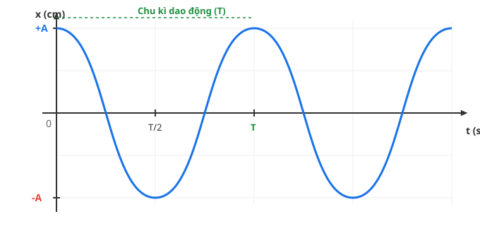
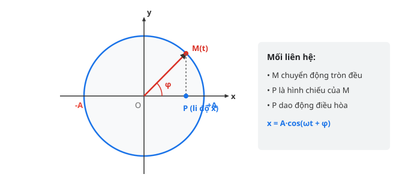

## Mục tiêu bài học
* **Về kiến thức:** Nắm vững định nghĩa dao động cơ học, dao động tuần hoàn và dao động điều hòa.
* **Về kĩ năng:** Xác định được biên độ $A$, tần số góc $\omega$, pha ban đầu $\varphi$, pha dao động tại thời điểm $t$, chu kì $T$ và tần số $f$ từ phương trình dao động hoặc đồ thị.

## Nhớ lại kiến thức cũ
* **Chuyển động tròn đều:** Một chất điểm chuyển động tròn đều với bán kính $R$, tốc độ góc $\omega$ thì góc quay sau thời gian $t$ là $\theta = \omega t + \varphi_0$.
* **Hàm lượng giác:** Hàm $\cos(\alpha)$ và $\sin(\alpha)$ là các hàm tuần hoàn với chu kì $2\pi$, có giá trị chạy trong đoạn $[-1; 1]$.

---

## 1. Dao Động Cơ Học (Thẻ: LY11.DD.01)

### Khái niệm
* **Dao động cơ học:** Chuyển động lặp đi lặp lại của một vật quanh một vị trí xác định, gọi là **vị trí cân bằng (VTCB)**.
* **Dao động tuần hoàn:** Là dao động mà sau những khoảng thời gian bằng nhau xác định gọi là **chu kì**, trạng thái chuyển động của vật lặp lại như cũ (về cả vị trí lẫn chiều chuyển động).
* **Dao động điều hòa:** Là dao động tuần hoàn mà li độ của vật là một hàm côsin (hoặc sin) theo thời gian.

> **Ví dụ thực tế:**
> * Cành cây đung đưa trong gió, chiếc thuyền bập bềnh trên sóng nước là các dao động cơ học.
> * Chuyển động của quả lắc đồng hồ hoặc con lắc lò xo khi bỏ qua ma sát là dao động tuần hoàn/điều hòa.

---

## 2. Phương Trình Dao Động Điều Hòa (Thẻ: LY11.DD.02)

Phương trình li độ tổng quát có dạng:
$$x = A \cos(\omega t + \varphi)$$

Trong đó:
* $x$: **Li độ** của vật, là tọa độ đo từ vị trí cân bằng đến vị trí của vật tại thời điểm $t$ (đơn vị: $\text{cm}$ hoặc $\text{m}$).
* $A$: **Biên độ dao động**, là độ lệch cực đại của vật khỏi vị trí cân bằng ($A > 0$). Quỹ đạo chuyển động là một đoạn thẳng dài $L = 2A$.
* $\omega$: **Tần số góc** của dao động (đơn vị: $\text{rad/s}$). Đại lượng này luôn dương ($\omega > 0$).
* $(\omega t + \varphi)$: **Pha của dao động** tại thời điểm $t$ (đơn vị: $\text{rad}$), cho phép xác định trạng thái dao động (vị trí và chiều chuyển động) ở thời điểm $t$.
* $\varphi$: **Pha ban đầu** tại thời điểm $t = 0$ (đơn vị: $\text{rad}$), phụ thuộc vào cách chọn gốc thời gian và chiều dương trục tọa độ. Quy ước $-\pi < \varphi \le \pi$.

*Hình 1. Đồ thị biểu diễn li độ $x$ theo thời gian $t$ với chu kì $T$.*

### Mối liên hệ chu kì $T$, tần số $f$ và tần số góc $\omega$
* **Chu kì ($T$):** Khoảng thời gian để vật thực hiện được một dao động toàn phần (đơn vị: giây - $\text{s}$).
  $$T = \frac{2\pi}{\omega} = \frac{\Delta t}{N}$$
* **Tần số ($f$):** Số dao động toàn phần vật thực hiện được trong một đơn vị thời gian 1 giây (đơn vị: Héc - $\text{Hz}$).
  $$f = \frac{1}{T} = \frac{\omega}{2\pi}$$

*Hình 2. Vòng tròn lượng giác biểu diễn li độ và pha dao động.*

> **Trọng tâm cần nhớ:**
> 1. Điểm $M$ chuyển động tròn đều với tốc độ góc $\omega$ trên đường tròn bán kính $R = A$. Khi đó hình chiếu $P$ của $M$ lên trục $Ox$ dao động điều hòa theo phương trình $x = A \cos(\omega t + \varphi)$.
> 2. Nửa trên đường tròn ($y > 0$): Pha dương ($\varphi > 0$) ứng với chất điểm chuyển động theo **chiều âm** ($v < 0$).
> 3. Nửa dưới đường tròn ($y < 0$): Pha âm ($\varphi < 0$) ứng với chất điểm chuyển động theo **chiều dương** ($v > 0$).

> **Lỗi thường gặp:**
> * Quên đổi đơn vị của $x$ và $A$ (ví dụ giữa mét và xentimét).
> * Biên độ $A$ luôn luôn là số dương ($A > 0$). Nếu phương trình có dấu trừ phía trước như $x = -4\cos(10t)$, cần dùng phép biến đổi lượng giác $- \cos(\alpha) = \cos(\alpha + \pi)$ để đưa về dạng chuẩn $x = 4\cos(10t + \pi)$.
